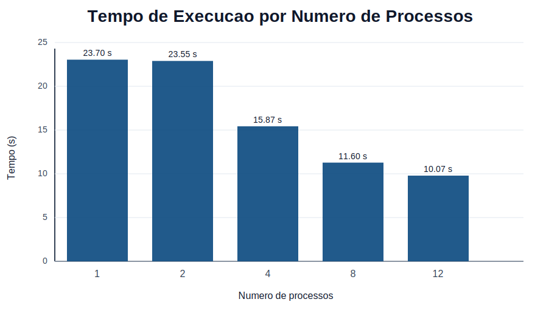
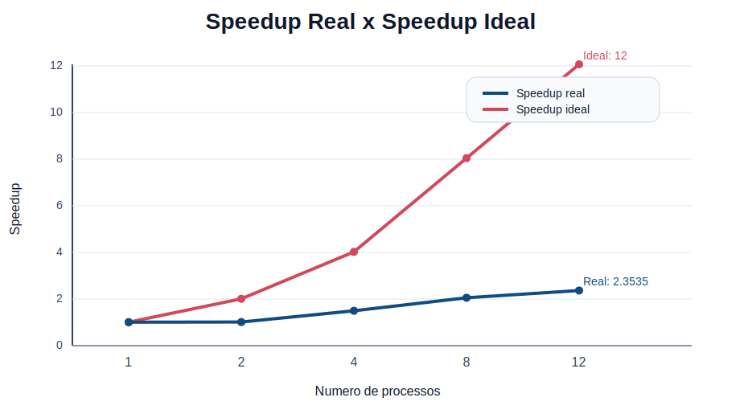
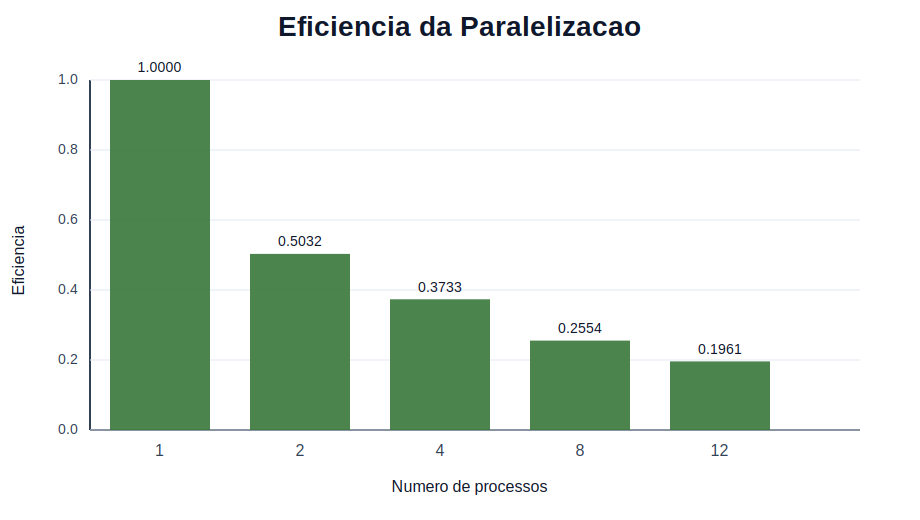

# Relatório Técnico de Avaliação de Desempenho da Solução MPI

**Disciplina:** Programação Concorrente e Distribuída  
**Aluno(s):** Ellen Vitorino 
**Turma:** S.I 05.1
**Professor:** Rafael
**Data:** 08/04/2026

---

## 1. Visão Geral do Experimento

Este relatório apresenta a análise de desempenho de uma aplicação em Python para comparação textual entre perguntas do dataset `nlp_features_train.csv`, utilizando uma versão serial e uma versão paralela com MPI.

O objetivo do experimento foi medir o comportamento da solução nas seguintes configurações:

- 1 processo na versão serial
- 2 processos MPI
- 4 processos MPI
- 8 processos MPI
- 12 processos MPI

Os resultados fornecidos mostram o tempo total de execução e o número total de pares avaliados em cada configuração. A partir desses dados, foram calculados os indicadores de speedup e eficiência, além da geração de gráficos para apoiar a análise.

Observação importante:

- embora parte do material de apoio use o termo "threads", o experimento executado neste projeto foi feito com **processos MPI**, conforme as saídas `Tempo total MPI` e o uso de `mpiexec`;
- como foi informado apenas um tempo por configuração, este relatório foi adaptado para trabalhar com **tempos medidos únicos**, e não com médias de múltiplas execuções.

---

## 2. Descrição do Problema

O programa processa perguntas textuais do dataset Quora Question Pairs e calcula a similaridade entre todos os pares possíveis de perguntas selecionadas.

### 2.1 Estratégia utilizada

O fluxo do programa pode ser resumido em quatro etapas:

1. leitura do arquivo `nlp_features_train.csv`;
2. limpeza e tokenização das perguntas da coluna `question1`;
3. comparação entre todos os pares possíveis de perguntas;
4. cálculo da similaridade de Jaccard para cada par.

### 2.2 Métrica de similaridade

A similaridade entre duas perguntas foi calculada usando o índice de Jaccard:

```text
J(A, B) = |A ∩ B| / |A ∪ B|
```

em que:

- `A` representa o conjunto de tokens da primeira pergunta;
- `B` representa o conjunto de tokens da segunda pergunta.

### 2.3 Complexidade

Como o algoritmo compara todos os pares possíveis, sua complexidade é aproximadamente:

```text
O(n²)
```

Essa característica torna a paralelização relevante, principalmente quando a quantidade de perguntas cresce.

### 2.4 Tamanho efetivo da entrada

Os resultados informados mostram que cada execução avaliou:

```text
12.497.500 pares
```

Esse valor corresponde à combinação de:

```text
5000 perguntas, tomadas 2 a 2
```

Portanto, o experimento efetivamente processou **5000 perguntas** do dataset.

---

## 3. Ambiente Experimental

Os testes foram executados em um computador com a seguinte configuração:

| Item | Descrição |
| --- | --- |
| Processador | Intel Core i7-10700 |
| Núcleos / Threads | 8 físicos / 16 lógicos |
| Memória RAM | 16 GB |
| Sistema Operacional | Windows 11 |
| Linguagem utilizada | Python 3.11 |
| Biblioteca de paralelização | MPI com `mpi4py` |
| Interpretador | CPython |


---

## 4. Metodologia de Testes

O procedimento experimental adotado foi o seguinte:

1. executar a versão serial do programa;
2. executar a versão paralela com 2, 4, 8 e 12 processos MPI;
3. registrar o tempo total de execução em cada configuração;
4. usar o tempo da versão serial como base para o cálculo de speedup e eficiência.

### 4.1 Configurações testadas

| Configuração | Tipo de execução |
| --- | --- |
| 1 processo | Serial |
| 2 processos | MPI |
| 4 processos | MPI |
| 8 processos | MPI |
| 12 processos | MPI |

### 4.2 Métricas utilizadas

As métricas calculadas foram:

**Speedup**

```text
Speedup(p) = T(1) / T(p)
```

**Eficiência**

```text
Eficiência(p) = Speedup(p) / p
```

em que:

- `T(1)` é o tempo da execução serial;
- `T(p)` é o tempo com `p` processos.

### 4.3 Observação metodológica

Como os dados disponibilizados contêm apenas um resultado por configuração, a análise foi feita diretamente sobre esses valores medidos. Isso atende ao experimento realizado, mas significa que o relatório descreve uma avaliação comparativa pontual, e não uma média estatística de múltiplas execuções.

---

## 5. Resultados Obtidos

### 5.1 Tempos medidos

| Processos | Tempo total (s) | Total de pares avaliados |
| --- | --- | --- |
| 1 | 23.70 | 12.497.500 |
| 2 | 23.55 | 12.497.500 |
| 4 | 15.87 | 12.497.500 |
| 8 | 11.60 | 12.497.500 |
| 12 | 10.07 | 12.497.500 |

### 5.2 Cálculo de speedup e eficiência

Tomando `T(1) = 23,70 s`, obtêm-se os seguintes valores:

| Processos | Tempo (s) | Speedup | Eficiência |
| --- | --- | --- | --- |
| 1 | 23.70 | 1.0000 | 1.0000 |
| 2 | 23.55 | 1.0064 | 0.5032 |
| 4 | 15.87 | 1.4934 | 0.3733 |
| 8 | 11.60 | 2.0431 | 0.2554 |
| 12 | 10.07 | 2.3535 | 0.1961 |

### 5.3 Exemplo de cálculo

Para 12 processos:

```text
Speedup(12) = 23,70 / 10,07 = 2,3535
Eficiência(12) = 2,3535 / 12 = 0,1961
```

---

## 6. Visualização dos Resultados

### 6.1 Tempo de execução

O gráfico a seguir mostra a redução do tempo total conforme o número de processos aumenta.



### 6.2 Speedup

O gráfico de speedup compara o ganho real obtido com a linha ideal de crescimento linear.



### 6.3 Eficiência

O gráfico de eficiência mostra quanto do paralelismo disponível foi efetivamente convertido em ganho de desempenho.



---

## 7. Análise dos Resultados

Os resultados mostram que a paralelização trouxe ganho de desempenho, mas esse ganho ficou bem abaixo do ideal.

### 7.1 Comportamento por configuração

- com 2 processos, o tempo praticamente não mudou em relação à versão serial, indicando que o overhead inicial da paralelização quase anulou o benefício computacional;
- com 4 processos, já se observa uma redução mais clara do tempo, com speedup de `1,4934`;
- com 8 processos, o ganho fica mais evidente, reduzindo o tempo para `11,60 s`;
- com 12 processos, foi obtido o melhor tempo do experimento, `10,07 s`, com speedup de `2,3535`.

### 7.2 Speedup e escalabilidade

O speedup real ficou distante do speedup ideal em todas as configurações. Em um cenário ideal, 12 processos tenderiam a produzir speedup próximo de 12, mas o valor observado foi apenas `2,3535`.

Isso indica que a aplicação apresenta **escalabilidade limitada**. Há ganho com o aumento do número de processos, porém esse ganho cresce de forma sublinear.

### 7.3 Eficiência

A eficiência caiu continuamente conforme o número de processos aumentou:

- `0,5032` com 2 processos;
- `0,3733` com 4 processos;
- `0,2554` com 8 processos;
- `0,1961` com 12 processos.

Esse comportamento mostra que, embora o tempo absoluto melhore, cada processo adicional contribui proporcionalmente menos para o ganho total.

### 7.4 Relação com o hardware utilizado

O processador do ambiente experimental possui:

- 8 núcleos físicos;
- 16 threads lógicas.

Assim:

- até 8 processos, a execução ainda se mantém dentro da quantidade de núcleos físicos disponíveis;
- com 12 processos, a aplicação ultrapassa os núcleos físicos e passa a depender também de threads lógicas do processador.

Mesmo assim, houve redução adicional do tempo em 12 processos, o que indica algum aproveitamento do paralelismo lógico. Porém, a eficiência nesse ponto é baixa, evidenciando retorno decrescente.

### 7.5 Principais causas prováveis do overhead

Os resultados são coerentes com a estrutura do programa e com as limitações típicas de paralelização em MPI:

- custo de distribuição dos dados para os processos;
- custo de sincronização e coleta dos resultados no processo principal;
- desequilíbrio parcial de carga, já que algumas faixas de comparação geram mais trabalho do que outras;
- pressão de memória, pois o programa armazena muitos resultados antes da ordenação final;
- crescimento do overhead de comunicação à medida que o número de processos aumenta.

Em outras palavras, o algoritmo é paralelizável, mas parte do tempo continua sendo consumida por operações que não escalam de forma linear.

---

## 8. Conclusão

Com base nos resultados fornecidos, conclui-se que a paralelização com MPI melhorou o desempenho da aplicação, mas não de forma proporcional ao número de processos utilizados.

O melhor resultado do experimento foi obtido com **12 processos**, atingindo:

- tempo total de `10,07 s`;
- speedup de `2,3535`;
- eficiência de `0,1961`.

Apesar de 12 processos produzirem o menor tempo absoluto, a eficiência já se encontra bastante reduzida, o que mostra que o ganho adicional vem acompanhado de overhead significativo.

De forma geral, o experimento demonstra que:

- a solução paralela é mais rápida do que a serial a partir de 4 processos;
- o ganho cresce com o aumento do número de processos, mas com forte perda de eficiência;
- a aplicação não apresenta escalabilidade linear;
- o custo de comunicação, sincronização e gerenciamento de resultados limita o aproveitamento do paralelismo.

Como melhoria futura, seria recomendável reduzir o volume de dados agregados no processo principal, minimizar cópias desnecessárias de estruturas e testar estratégias de balanceamento mais refinadas para tentar aumentar o speedup e a eficiência.
